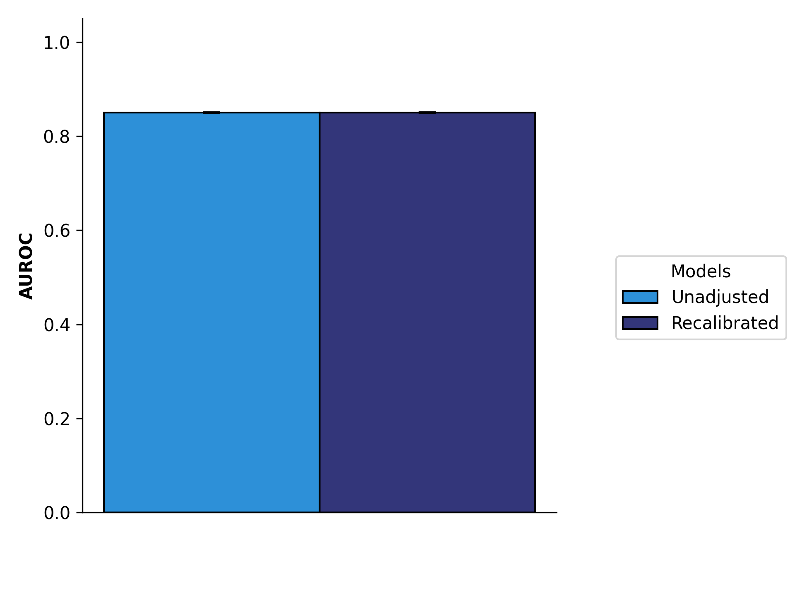
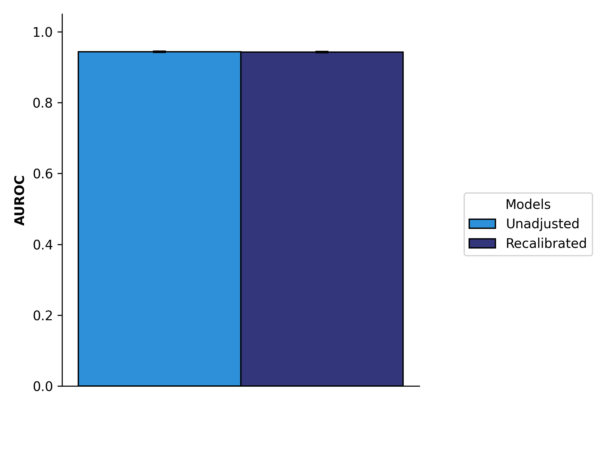
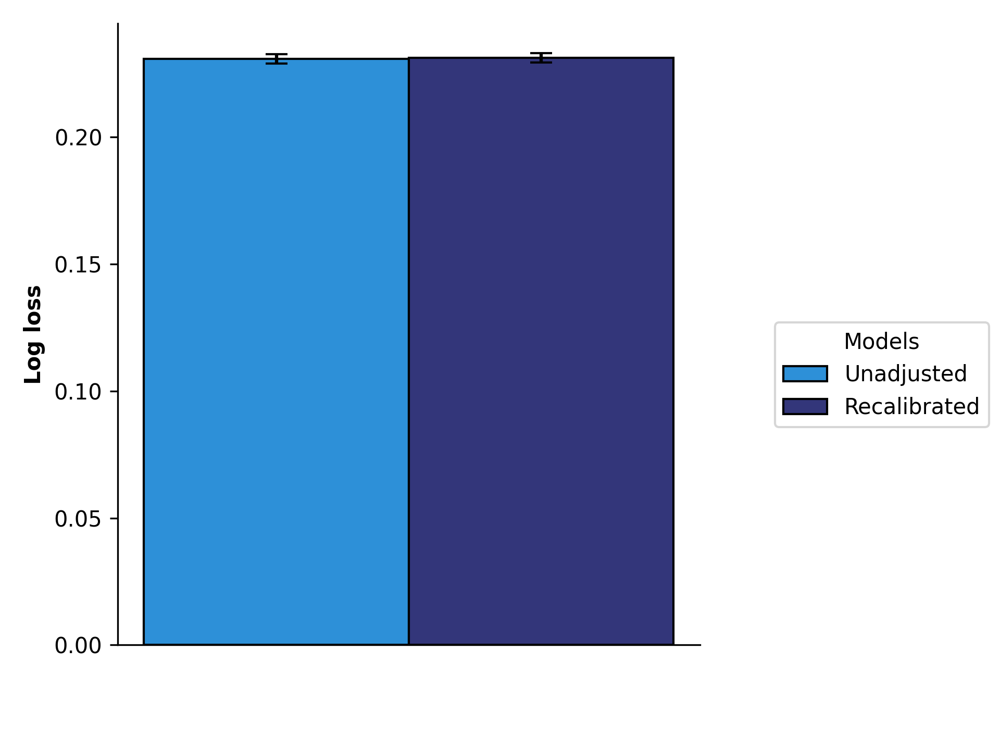
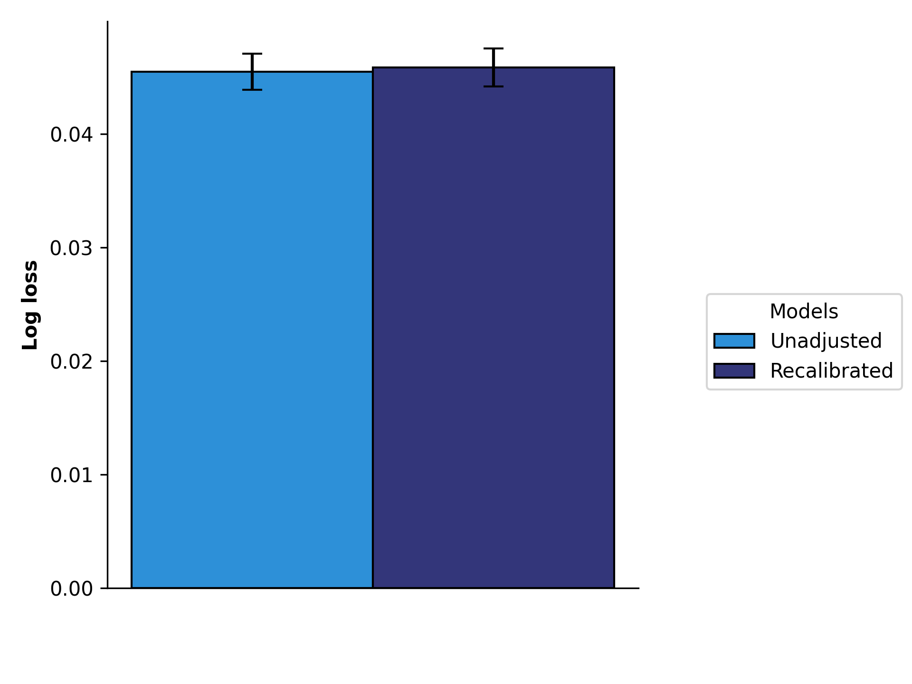
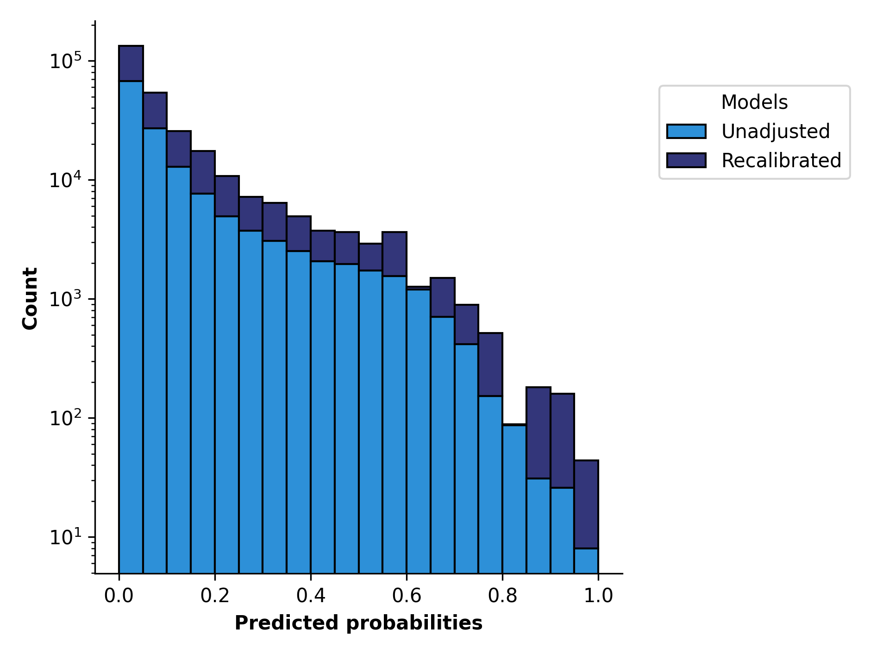
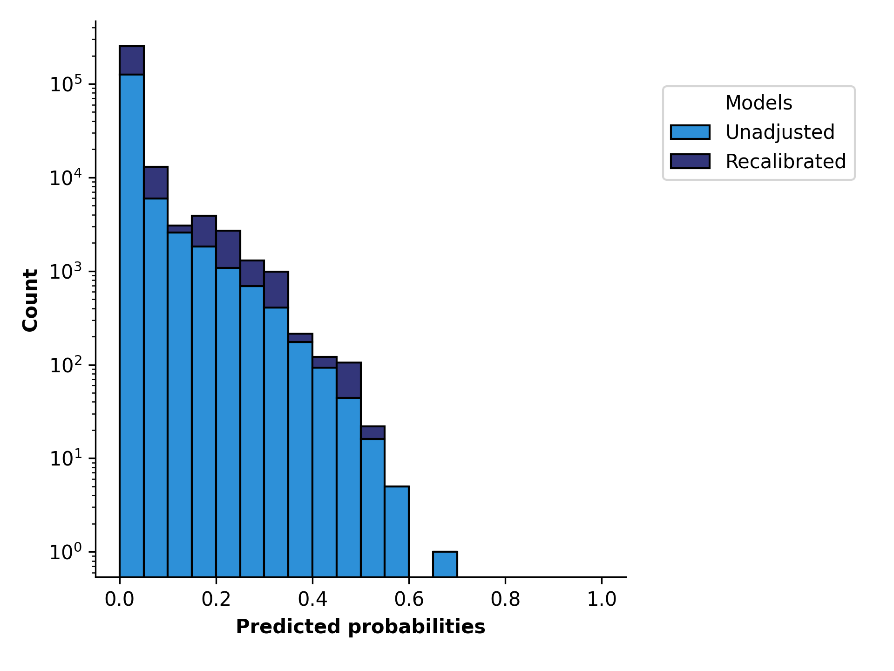
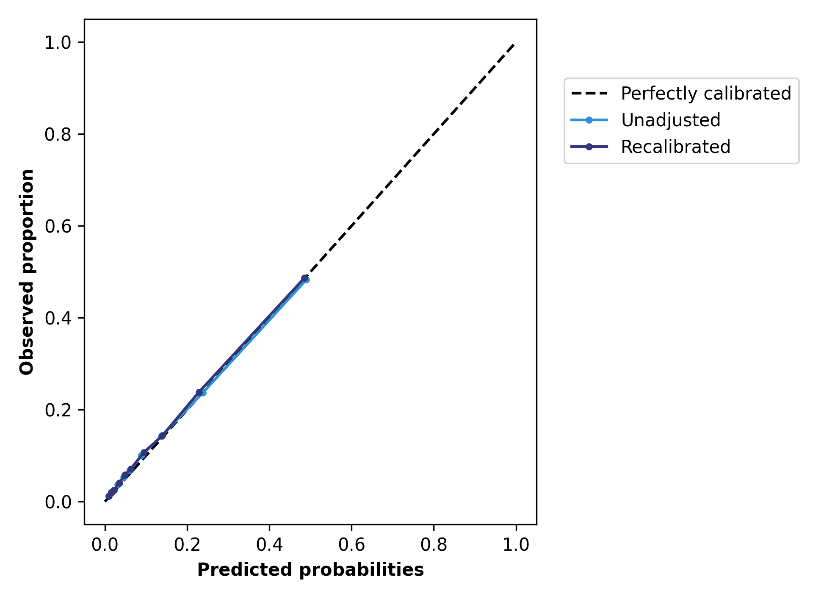
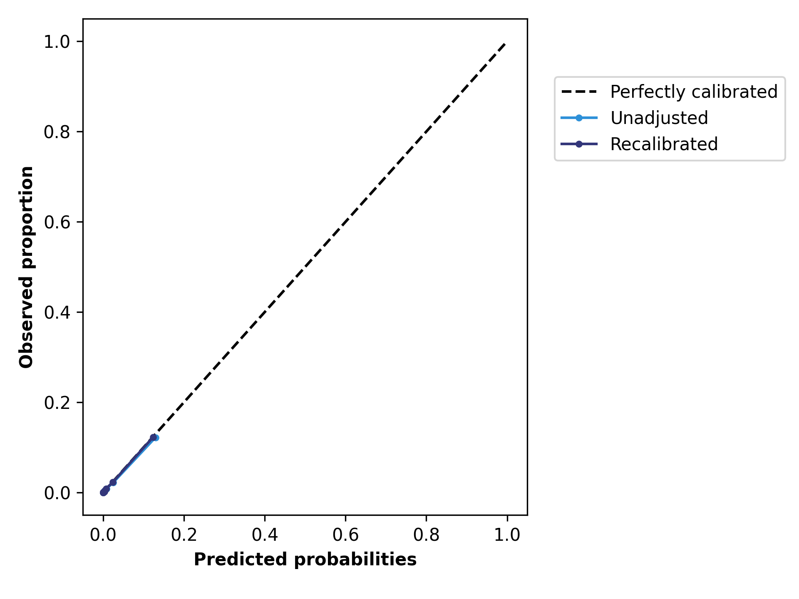

# pyrisk


[](https://www.python.org/downloads/)
[](https://github.com/Surgical-Recovery-and-Safety-Lab/pyrisk/actions/workflows/run_test.yml)
## Table of content
1. [Overview](#overview)
2. [Installation](#installation)
3. [Usage](#usage)
	1. [Preprocessing operations](#preprocess)
	2. [Models](#models)
	3. [Recalibration](#recalibration)
	4. [Metrics](#metrics)
	5. [Plots](#plots)
5. [Examples](#examples)

## Overview
The **pyrisk** package is a layer to help create AI models for clinical applications. It covers data loading and preprocessing, model creation and training, recalibration, and visualisation. 
___
## Installation

To install **pyrisk** clone the GitHub repository and install the package with pip: 
```
$ git clone git@github.com:Surgical-Recovery-and-Safety-Lab/pyrisk.git
$ cd pyrisk
$ pip install .
```
**NOTE**: It is recommended to use a virtual environment (venv) to install this package. 

Ensure that the installation was succesfull and that all tests pass by running the following command in the pyrisk directory:
```
$ pytest 
```
___

## Usage
This package was tested on a Linux distribution (Ubuntu 24.04) with Python v3.12.3. The [sckit-learn](https://scikit-learn.org/stable/index.html) was used as the base of most of the code. 

A Pipeline contains the preprocessing operations, a model for each prediction label, and a recalibration model (if specified) for each label. Thus, with only a few lines of code, several models can be created from the same data and fitted. 

### Preprocessing operations
Currently four preprocessing operations are available:
* **standarise**, this operation standardises the input features by removing the mean and scaling to unit variance;
* **ordinal encoding**, this operation converts non-numerical categorical input features into ordinal ones;
* **power transform**, this operation applies a power transform to make the data more Gaussian-like;
* **binning**, this operation converts a continuous input feature into bins and caps the value. 

### Models
There is only one classifier available at the moment: the histogram boosted gradient classifier. 

**NOTE:** Adding a new model only requires editing the **create_model** function in *models/core*. To work, it must have a fit and predict method. 

### Recalibration
Two recalibration models are available: logistic regression, and isotonic regression. 

### Metrics
The available metrics are divided into the score metrics and prediction metrics. The list of available metrics is the following:

| Metric | Type | Description |
| :--- | :--- | :--- |
| Accuracy | Prediction | Proportion of all classifications that were correct. |
| Recall | Prediction | Proportion of all actual positives that were classified correctly (true positive rate). |
| Precision | Prediction | Proportion of all the  positive classifications that are actually positive. |
| F1 score | Prediction | Harmonic mean of precision and recall. |
| AUROC | Score | Area under the ROC curve. |
| AP | Score | Area under the precision-recall curve. |
| Log loss | Score | Logarithmic loss. |

### Plots

Three types of plots are available: bar graphs for the metrics, predicted probability distributions, and calibration curves. 

The following graphs are from one pipeline with two models, one to predict complications and the other to predict 90-day mortality. The predictor and calibrator results are plotted on the same graphs to compare the effect of recalibration. 

Plots of the AUROC and log loss metric values with confidence intervals for each outcome:

| Any complication | 90-day mortality |
| :---: | :---: |
|  |  |
|  |  |


Predicted probability distributions for each outcome:

| Any complication | 90-day mortality |
| :---: | :---: |
|  |  |


Calibration curves for each outcome:

| Any complication | 90-day mortality |
| :---: | :---: |
|  |  |
___
## Example

Here is a short example that shows how to load data, train the models, and plot the calibration curves:

``` py linenums="1"
from pyrisk import (
	Pipeline
	read_toml_configuration,
	load_data_from_csv,
	get_positive_proba,
	extract_labels,
	plot_reliability_diagrams,
)

# Load configuration and data
config = read_toml_configuration("config_file.toml")
data = load_data_from_csv("data.csv")

# Create pipeline
pipeline = Pipeline(general_config)

# Split data into sets and train model
X_train, X_test = pipeline.get_test_data(data)
pipeline.run(X_train)

# Plot calibration curve
X_test, y_test = extract_labels(X_test, pipeline.label_list)
y_pred_proba = pipeline.predict_proba(X_test)
plot_reliability_diagrams(y_test, get_positive_proba(y_pred_proba, display_kwargs={"n_bins": 10, "strategy": "quantile"})

```
